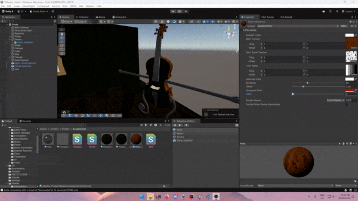

# Prerequisite Packages

There are some packages you will need to install manually.

## FMOD

You can get the FMOD package from
the [Unity Asset Store](https://assetstore.unity.com/packages/tools/audio/fmod-for-unity-161631).

#### FMOD Studio

If you would like to edit the FMOD project, you will need to download FMOD Studio from
the [FMOD website](https://www.fmod.com/download#fmodstudio).

### Setup

After importing the package into Unity, FMOD will open the setup wizard:

1. Open the Sample Scene in `Assets/_Project/Scenes/Sample Scene.unity`.
2. Open the wizard again (`FMOD > Setup Wizard`).
3. In the **Linking** section, click **FMOD Studio Project**, and navigate to `FMOD/FMOD.fspro`.
4. Run through the rest of the wizard, and you're good to go!

## Odin

You can get Odin via the [educational license](https://odininspector.com/educational/ontario-tech-university) or
from the Unity Asset Store ([Inspector & Serializer](https://assetstore.unity.com/packages/tools/utilities/odin-inspector-and-serializer-89041) and [Validator](https://assetstore.unity.com/packages/tools/utilities/odin-validator-227861)).

You will need the inspector, serializer and validator

### Setup

There's minimal setup. After opening the project, simply import the ```.unitypackage``` and go through the basic setup

## PrimeTween
Pick it up from [here](https://assetstore.unity.com/packages/tools/animation/primetween-high-performance-animations-and-sequences-252960), and import it from the package manager (Window > Package Manager > My Assets > Search PrimeTween).

# Implementation Details

## Part 1: Base:
Below are the implementations:
- Dynamic game objects: Dashing player
- Playable MC: Seria (MC)
- Game objects suitable for scene: Floor, distorted wall, nightstand, frame (this is a classical/baroque style)
- Win/lose condition: fires on death/kill

## Main Shader (Ruidger)   

This shader is split into 4 main componenets to get the effect. The two main ideas behind this shader is, I want a toonshader that is animated in a sense and is module to create more subshaders in the future. The shader itself has a lot of properties that can be adjusted in the future base on what mesh I'm applying it too. 

The first part is for the shader to identify the main texture of the object. In this case due to it being a template shader, I have a general node. 


The MainLight function take the built in light and finds the direction that the light is shining in and takes that output to perform dot product with the normals of the mesh. 
I am using a customLight function to find the exact direction that the rays are hitting the normal of the mesh. 


This part of the shader is calculating the toon shading to create the different lights on the object. I calculated the dot product between the MainLight and the normal of the object. 
Then I create two step nodes to create the main tone and the highlights of the shader. Afterwards I applied it to a lerp node to find what shade I want the midtone to be. 


Finally, I apply this in the UV section of the sample texture. The texture I placed inside it is a typical toon ramp with 5 section. I also tried to apply a step to make the black sections appear as white on the mesh for the mid-tone and the shadows. I do know where I went wrong and probably should have multiplied it with the same Color property that I used in the other parts of the shader. Anyways, I then multiplied it with the main texture so that it actually appears on the animated section, and re-add it to the sample texture which will add the paintbruh texture and the midtone + highlight from the toon ramp. This is a bit flawed to be fair with what we want to implement. In the future, I will clean this part of the shader up to create my intended effect. Which is to multiply the sample texture with the Color property and then re-add it to have that white paint brush effect similar to the rim-light. Finally, I added this to the Base Color for the output.   


Next is on the emission effect which is based on the rim-light/fresenl effect in shader graph. I multiplied the results of the lerp node with this set of nodes above. This set of nodes is waht I also used for the rim-lighting in the other aspect of the shader. 
What this does is it takes the tiling of paintbrush texture I created in Substance Designer and uses the time node to move it with the tiling and offset node. Then I apply it to the UV input of the sample texture 2D to animate the texture to have more sense of movement within the shader. I have this multiplied to both aspects of the rim-light emission  


How I started the emission effect of the shader is by offsetting the normal of the mesh. My original idea was to have the textured rim-light feel more like an "aura"/"shielding" effect on the mesh. I wanted it to appear off the mesh to add a more artistic outline to the mesh (this was before I found out about the Post Processing outline effect). I haven't attempted to implement the outline effect yet due to my technical incapabilities. 


I then took that fresnal effect and applied a step node with a threshold to determine how thick I want it to be. I then multiple it with the Color "Darkest Color". While the preset is white, I can change it to any color in the future that reflects the mesh/object best in the future. Then I multiply it with the animated aspect, the same one as above, to have the rim-light animate the same way the main texture is. 


I then created a thicker band of the rim-light so I can apply two different colors in the future if I so desire. I still need to add a multiply node with another color so that we can change it with any color we desire. This one is more thicker to immitate a more mid-tone in terms of facing the light head on. 


Finally, I add them together cause I want to keep their seperate effects and multiply it with the dot product between the normal and mainlight from earlier. This makes it so that the rim-light will only appear on the highlights from the toonshader. This puts emphasis on the highlights and ensures that the rim-light follows the logic set out by the toonshader aspect and creates a more logically consistent shader. I will experiment with the full body outline to see if it has a more drastic effect in the game that we're making. 

Overall, this base shader has all the base effects of what we want for the game. Now it's all about fine tuning and tinkering the shader on an object-by-object bases to find the best effect for the object in question. 

## Part 2: Illumination (Adam):
I implemented the toggling of the states using a float in the shader.
This was done by using a switch statement inside the shader to determine which state the object is in. The states are as follows:
0: diffuse
1: diffuse + ambient
2: diffuse + specular
3: diffuse + ambient + specular
4: toon
5: toon + diffuse + ambient + specular
But how was I able to integrate the shadergraph version that Ruidger made into the hlsl version?
I had to recreate it. Details are inside `Assets/_Project/Shader/Assignment/Paint.shader`
## Part 4: Shaders and Effects (Adam + Ruidger):
Since we have two people in our group, we did three shader implementations:
### Main Shader:
Ruidger made the shadergraph version that you already saw, and I turned it into HLSL.
This uses rim lighting and diffuse
### Paint Shader:
